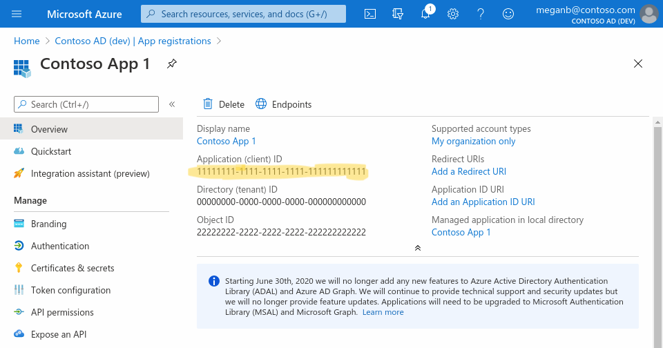

# Elgato Streamdeck Plugin for Microsoft 365

Elgato Stream Deck Plugin for Microsoft 365

## Setup

The plugin uses the Microsoft Graph API for accessing the necessary information.

1. You have to create an App first to use this Plugin: https://learn.microsoft.com/en-us/azure/active-directory/develop/quickstart-register-app

2. After creating the app, you have to copy the "Application (client) ID" and paste it in the Stream Deck Plugin configuration for the button.

3. Click the "Add" button to add your Microsoft accounts. Your web browser will open and you have to authenticate. That's all.

Hint: Your accounts are saved per Application ID. So, if you reuse the same App ID for all your actions, you don't have to authenticate again. Just pick your account from the list.

## Current features

### Mail

- Shows unread mails
- Highlights button when there are unread mails
- Button opens the inbox in web browser

### Calendar

- Shows the number of planned events for today or tomorrow, if there aren't any for the current day
- Changes button color, depending on the time the next event starts
- Button opens the calendar in the web browser