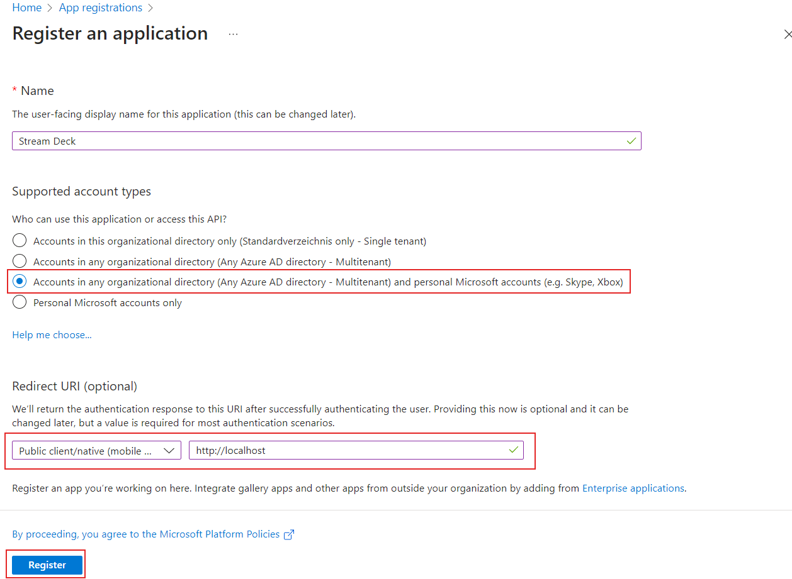
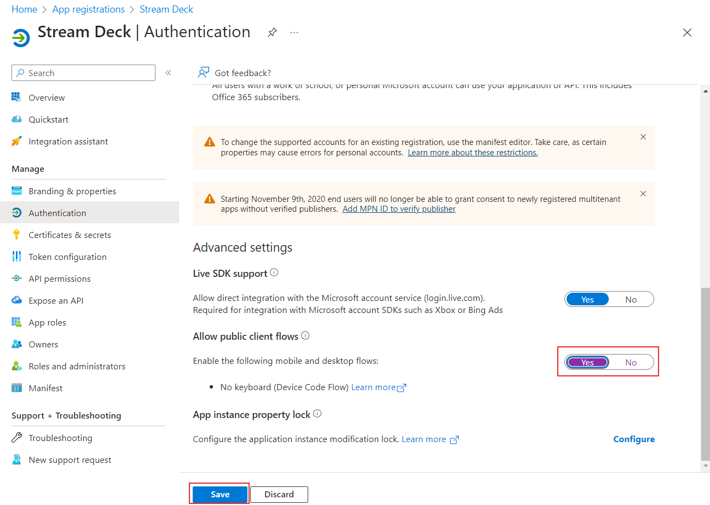
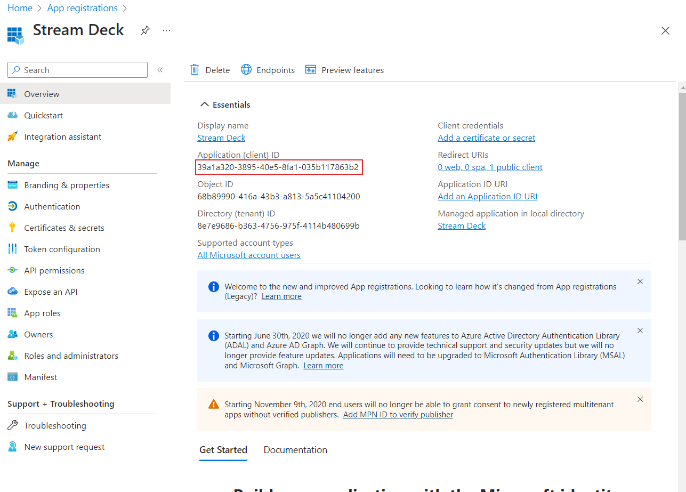

# Create Azure app

## 1. Sign in to the Azure Portal

Visit https://portal.azure.com and sign in with your Microsoft account.

## 2. Start the app creation wizard

Search for "App registrations", then click "New registration"

## 3. Setup your app

Name your app, select the account type and the redirect URI like shown in the image below.

## 4. Activate public client flow

Activate public client flow authentication like shown in the image below

## 5. Copy the application ID

Copy the application ID and then paste it into the Elgato Stream Deck Microsoft 365 Plugin Settings.

